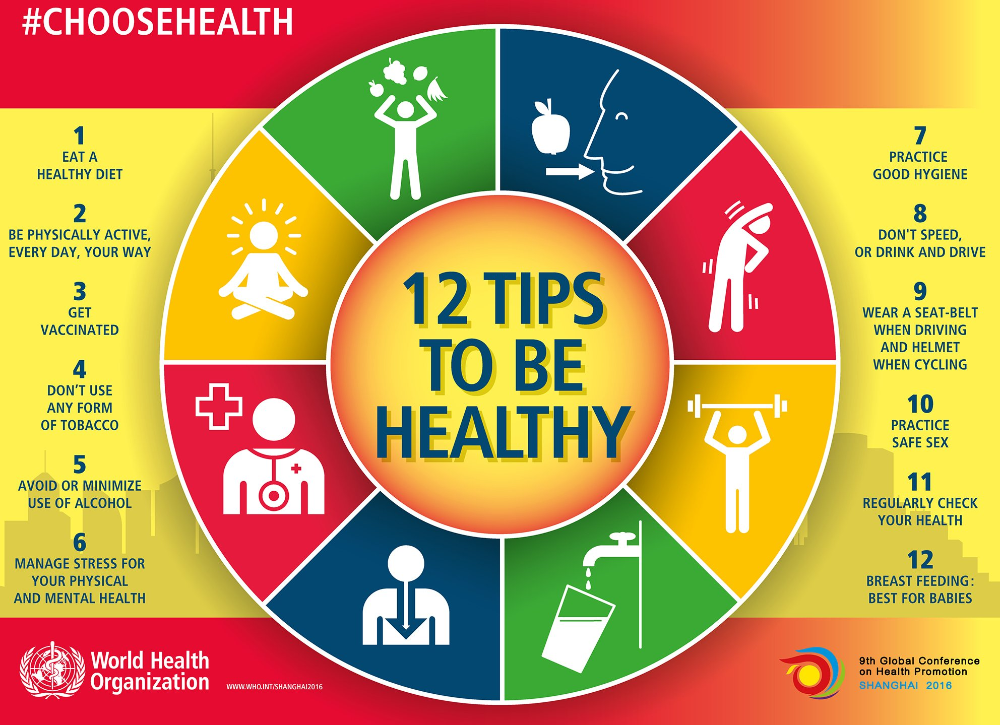

{width=500px}

 

### Introduction

Nowadays, as the socioeconomoic level of people' lives develops, more and more attention are paid at enhancing personal health and lifestyles. Eating health, as an indispensable component of individual's biological maintainence, plays a vital role in strengthening personal immunity and preventing chronic diseases, including regular eating habits and nutritional diets. Addressed in "Eating and Health Module" (2019, Economic Research Service), eating patterns are strongly affected by people's economic status and behaviors, including household income, engagements in physical activities, food preparation styles, accessibilities to grocery stores, and etc. From the aspect of public health and policy, understanding how these indicators affect personal eating health can assist the government to develop effective and efficient food and nutrition assistance programs, increasing stable and harmonized relationship between people and society. This project, starting from these beneficial standspoint, explores impacts of  different indicators on personal eating health.

### Data

The dataset is obtained and downloaded from Economic Research Service of United States Department of Agriculture, named "Eating and Health Module". The dataset is case-specific repsondent file, including general personal biolgical information (height, weight), household information (income, engaged government assistance programs), eating habits (fast food consumption, drink habits, food preparation), and physcial activities of repsondents. The whole data collection was conducted by Questionnaire and Survey, based on answers of voluntary respondents. We mainly started with exploring sample selection of repsondents via several descriptive statistics on their general health information. Then we analyzed associations or distributions of internal or external indicators for understanding their impacts on personal eating health by using persoanl BMI value as the parameter, including accessibilities of grocery stores, conditions of household income, frequency of fast food consumptions and engagements of physical activities. Analysis would include different association plots and multi-linear regression model. We aso established the hypothesis testing for measuring similarity or difference resided between primary and secondary eating behaviors of respondents.

### Findings

### Report

Our report can be found [here](classfication_report.html).

### Team members

- Qetsiyah Wang yw3439 ｜[Website](https://yw3439.github.io/)
- Yue Chen yc3732      ｜[Website](https://yc3731.github.io/)
- Qianhui Xu qx2199    ｜[Website](https://qx2199quintus.github.io/)
- Shunyi Zhang sz2872  ｜[Website](https://shane-1996.github.io/)

### Tips for Better Health

{width=500px}

 